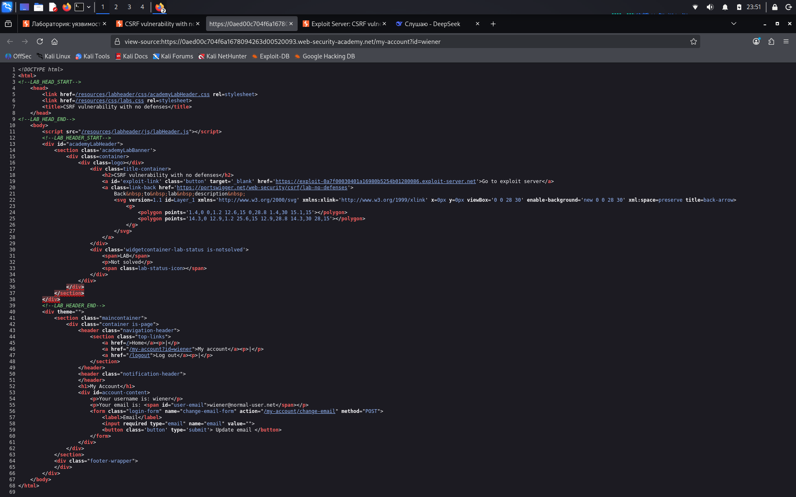

# CSRF vulnerability with no defenses

**Сложность:** Apprentice  
**Тема:** CSRF  
**Ссылка:** [PortSwigger](https://portswigger.net/web-security/csrf/lab-no-defenses)  

## 1. Описание уязвимости

Форма изменения email (`/my-account/change-email`) не содержит **CSRF-токена** и не проверяет источник запроса.  
Это позволяет злоумышленнику создать вредоносную HTML-страницу, которая автоматически отправит POST-запрос от имени авторизованной жертвы.

---

## 2. Разведка

Открыл лабораторную - это интернет-магазин с функцией регистрации и личным кабинетом. Залогинился под тестовым пользователем и перешёл в раздел "My account". Там обнаружил форму изменения email, которая отправляет POST-запрос на `/my-account/change-email` с параметром `email`. Внимательно изучил HTML-код формы через DevTools: в ней отсутствует скрытое поле с CSRF-токеном. Также проверил, что сервер не проверяет заголовки Referer и Origin. Это значит, что любой сайт может отправить запрос от имени авторизованного пользователя. Вывод: форма уязвима к CSRF-атаке, так как нет никакой защиты от подделки запроса.

---

## 3. Ход решения

Открыл exploit server (кнопка "Go to exploit server" в лабораторной).
В поле "Body" вставил вредоносный HTML-код с авто-отправкой формы:

