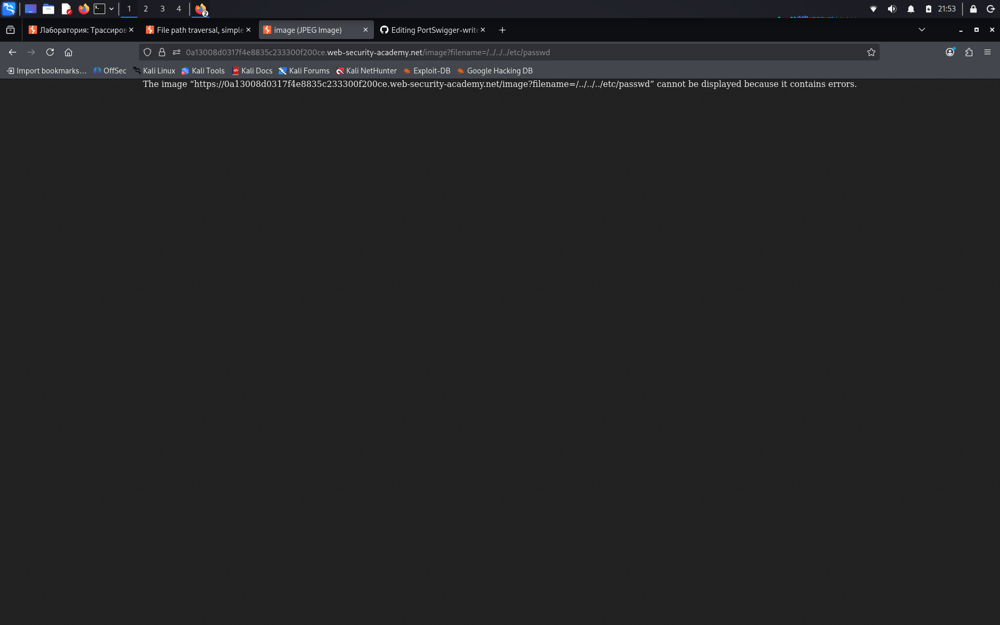

# File path traversal, simple case

**Сложность:** Apprentice  
**Тема:** Path traversal  
**Ссылка:** [PortSwigger](https://portswigger.net/web-security/file-path-traversal/lab-simple)  

## 1. Описание уязвимости

Эта лаборатория содержит уязвимость прохождения пути в отображении изображений продукта. Чтобы решить лабораторию, извлечь содержимое `/etc/passwd` файл.

---

## 2. Разведка

Открыл лабораторную - это интернет-магазин.  

---

## 3. Ход решения

Решение данной лабортории очень просто, я открыл фотографию одного из товара с новом окне, после именил ссылку на такую: `/../../../etc/passwd`

