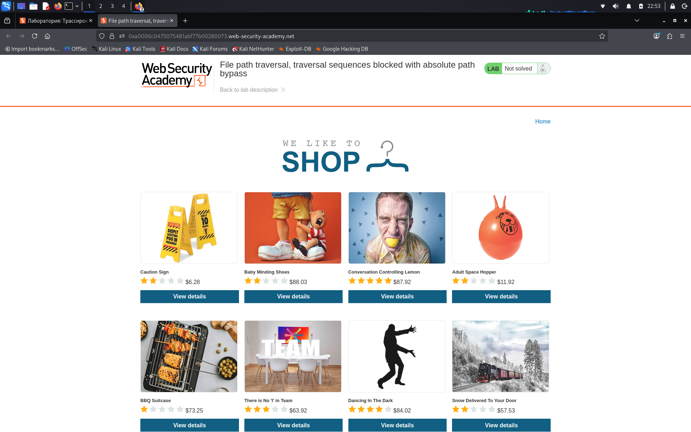
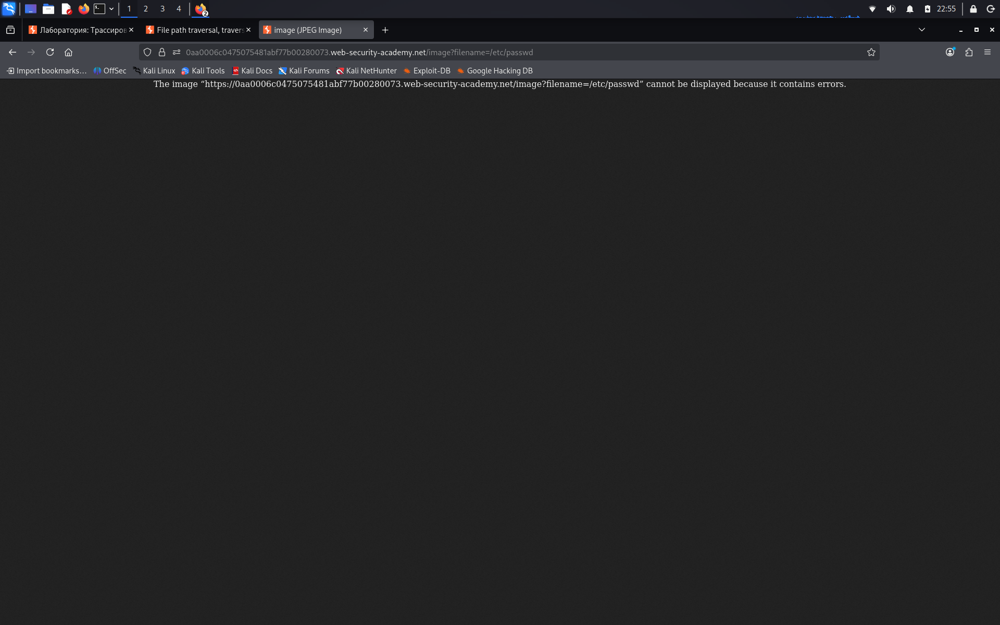

# File path traversal, traversal sequences blocked with absolute path bypass

**Сложность:** Practitioner  
**Тема:** Path traversal  
**Ссылка:** [PortSwigger](https://portswigger.net/web-security/file-path-traversal/lab-absolute-path-bypass)  

## 1. Описание уязвимости

Эта лаборатория содержит уязвимость прохождения пути в отображении изображений продукта. Приложение блокирует последовательности транзакций, но рассматривает отображаемое имя файла как относящееся к рабочему каталогу по умолчанию.

---

## 2. Разведка

Открыл лабораторную — это интернет-магазин с изображениями товаров. Изображения загружаются через параметр `filename` в URL: `/image?filename=1.jpg`.

---

## 3. Ход решения

Зашел в описания одного из товаров магазина, открыл фотографию товара в отдельнок окне, изменил `URL` на такой: `/etc/passwd`

---
