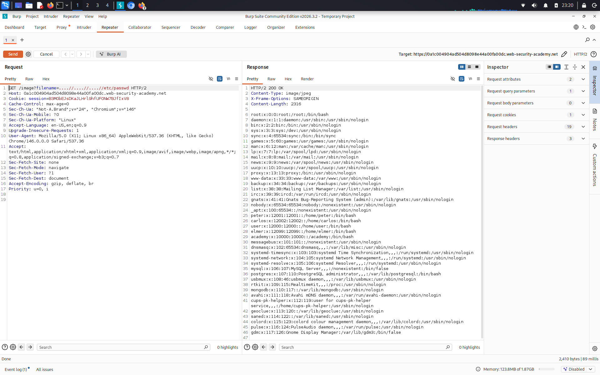

# File path traversal, traversal sequences stripped non-recursively

**Сложность:** Practitioner  
**Тема:** Path traversal  
**Ссылка:** [PortSwigger](https://portswigger.net/web-security/file-path-traversal/lab-sequences-stripped-non-recursively)  

## 1. Описание уязвимости

Эта лаборатория содержит уязвимость прохождения пути в отображении изображений продукта. Приложение удаляет пути проходных последовательностей из поданного пользователем имени файла перед его использованием.

---

## 2. Разведка

Открыл лабораторную — изображения загружаются через `/image?filename=1.jpg`. Сервер удаляет `../`, но **нерекурсивно** — один раз. Значит, `....//` после удаления превратится в `../`. Это обходит фильтр.

---

## 3. Ход решения

Открыл лабораторную и нашёл URL загрузки изображений: `/image?filename=1.jpg`. Проверил, что сервер блокирует `../`. Использовал обход: `....//` - после удаления `../` остаётся `../`. Отправил payload `....//....//....//etc/passwd`. Сервер вернул содержимое `/etc/passwd` - лаба решена.

---
