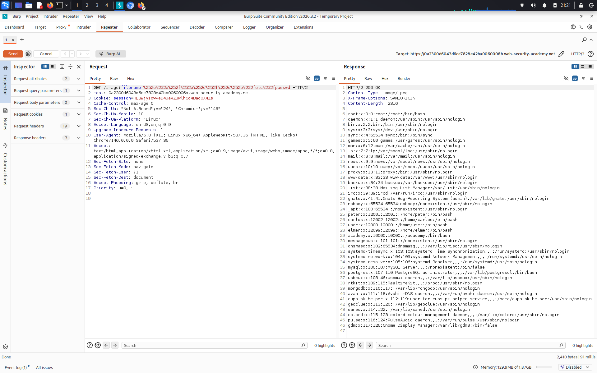

# File path traversal, traversal sequences stripped with superfluous URL-decode

**Сложность:** Practitioner  
**Тема:** Path traversal  
**Ссылка:** [PortSwigger]  

## 1. Описание уязвимости

Эта лаборатория содержит уязвимость прохождения пути в отображении изображений продукта. Прикладные блоки ввода, содержащие последовательности прохождения пути. Затем он выполняет URL-деко ввода перед его использованием.

---

## 2. Разведка

Изображения загружаются через `/image?filename=1.jpg`. Сервер удаляет `../` и **дополнительно URL-декодирует** ввод. Обычные payload'ы не работают. Но если **дважды** закодировать `../` → `%252e%252e%252f`, после двух декодирований получится `../`. Это обходит фильтр.

---

## 3. Ход решения

Изображения загружаются через `/image?filename=1.jpg`. Сервер удаляет `../` и **дополнительно URL-декодирует** ввод, поэтому обычные payload'ы не работают. Я **дважды закодировал** последовательность `../`: `%252e%252e%252f`. После первого декодирования получилось `%2e%2e%2f`, после второго — `../`. Отправил payload `%252e%252e%252f%252e%252e%252f%252e%252e%252fetc%252fpasswd` через Burp Repeater. Сервер вернул содержимое `/etc/passwd` — лаба решена.

---
