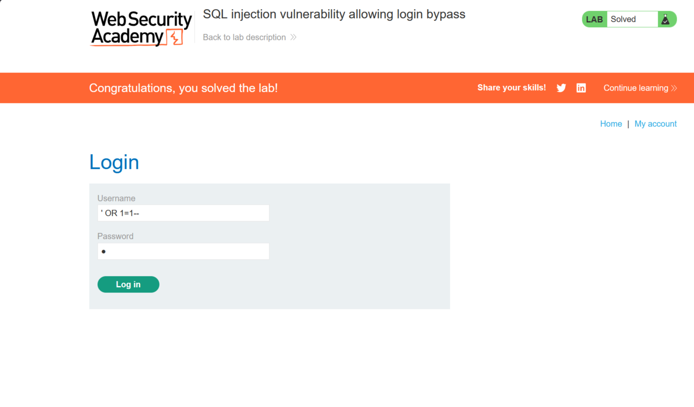
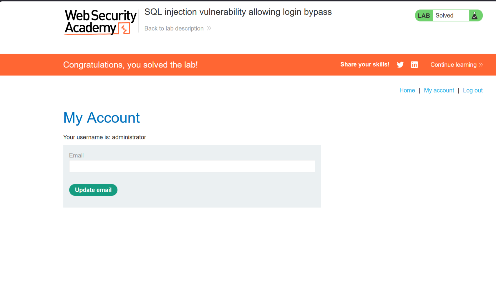

# Lab: SQL injection vulnerability allowing login bypass

**Сложность:** Apprentice
**Тема** SQL Injection
**Ссылка** [PortSwigger](https://portswigger.net/web-security/sql-injection/lab-retrieve-hidden-data)

## 1. Описание уязвимости

Форма входа уязвима к SQL-инъекции.  
Можно войти в аккаунт администратора, не зная пароля, путём внедрения SQL-кода в поле username.

---

## 2. Разведка

Открыл лабораторную - увидел интернет магазин с кнопкой **"My account"**.
Нажал на нее и увидел форму входа (логин + пароль)

---

## 3. Ход решения

1. В поле **username** ввёл: `' OR 1=1--`
2. В поле **password** ввёл любой пароль (например, `1`).

3. Нажал "Login".
4. Сайт пустил меня в аккаунт **administrator**.

