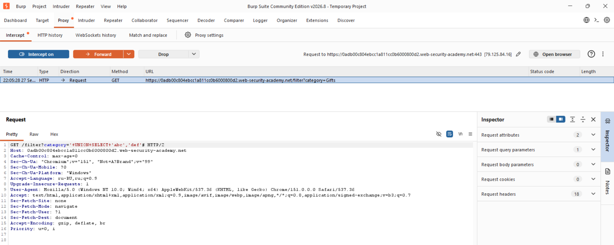
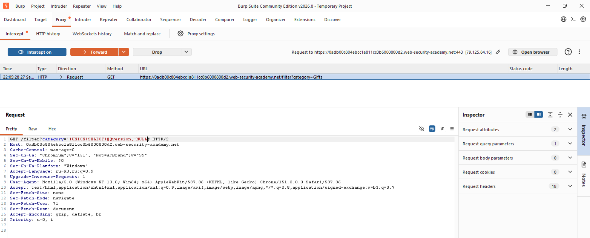
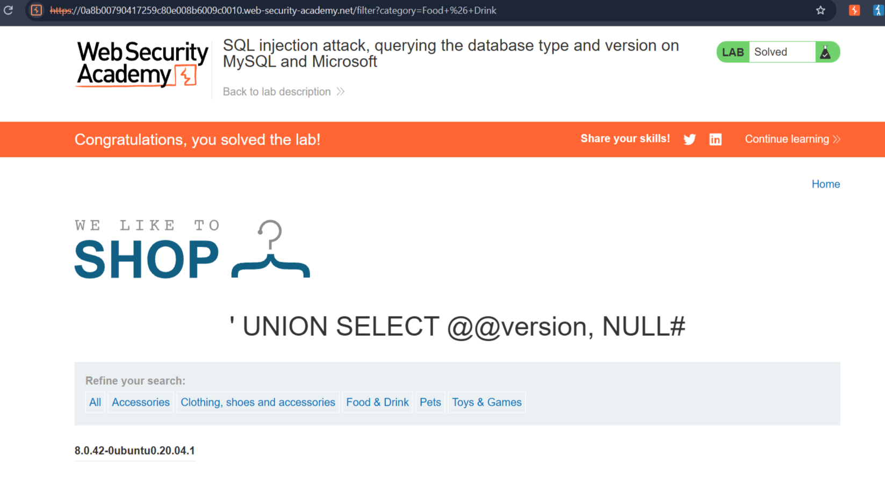

# SQL injection attack, querying the database type and version on MySQL and Microsoft

**Сложность:** Practitioner  
**Тема** SQL Injection  
**Ссылка** [PortSwigger](https://portswigger.net/web-security/sql-injection/examining-the-database/lab-querying-database-version-mysql-microsoft)  

## 1. Описание уязвимости

Эта лаборатория содержит уязвимость инъекций SQL в фильтре категории продукта. Параметр `category` в URL передается в SQL-запрос без экранирования.
Это позволяет внедрить произвольный SQL-код и получить данные, которые не должны отображаться.

---

## 2. Разведка

Открыл лабораторную, увидел сайт магазина, есть разные категории, обратил внимание на URL при выборе категории.

---

## 3. Ход решения

В данной лабораторной работе я использовал `BurpSuite`, я перехваттил запрос и изменил URL на такой: `.../filter?category='+UNION+SELECT+'abc','def'#`, что помогло мне понять, что в этой БД два столбца.

После того, как я узнал количество столбцов, я снова перехватил запрос и изменил URL на такой: `...filter?category='+UNION+SELECT+@@version,+NULL#`, это и оказалось правильным решением.

После применения уязвимости, страница вывела данные, которые не должны отображаться

