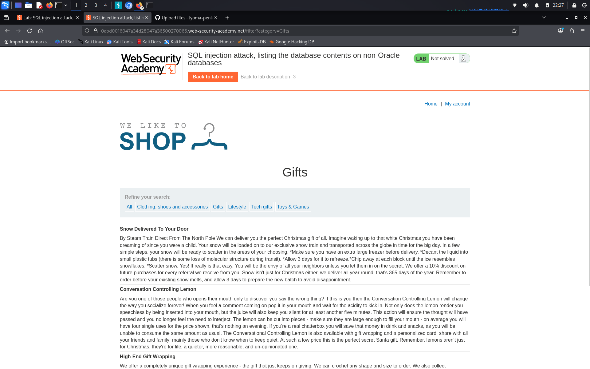
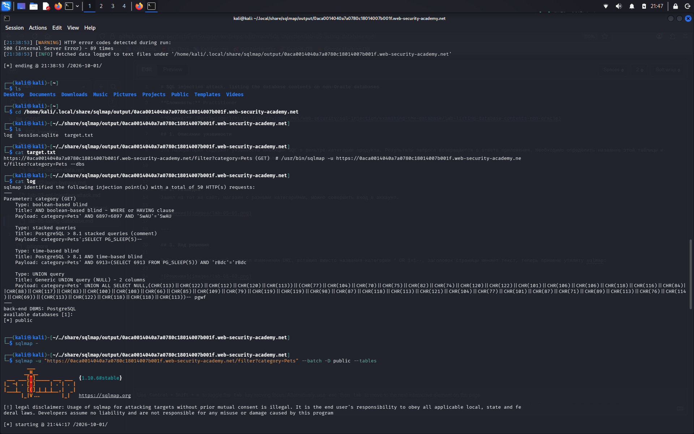
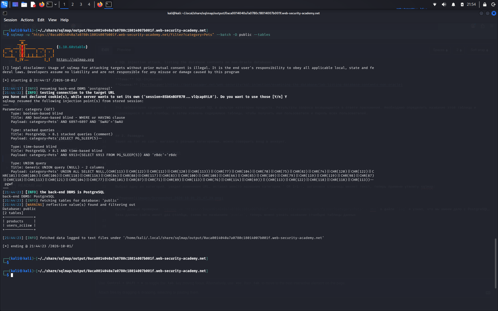
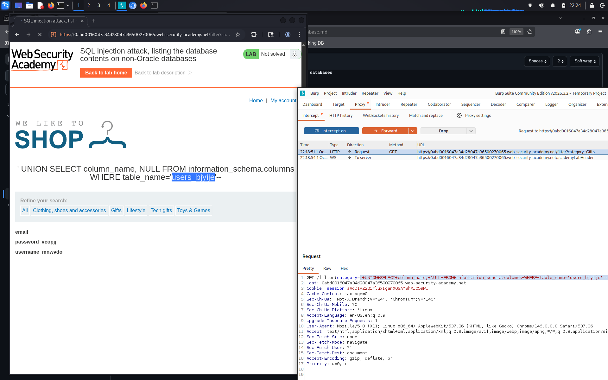
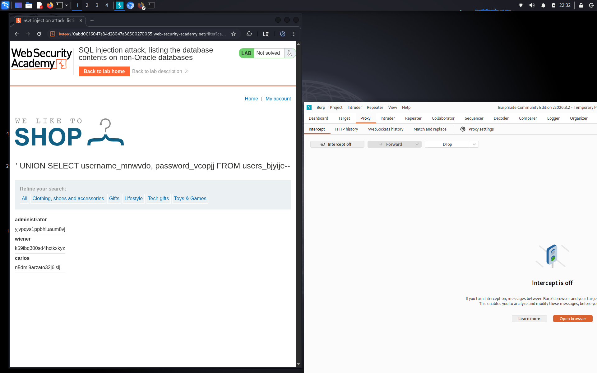

# SQL injection attack, listing the database contents on non-Oracle databases

**Сложность:** Practitioner 
**Тема:** SQL-Injection  
**Ссылка:** [PortSwigger](https://portswigger.net/web-security/sql-injection/examining-the-database/lab-listing-database-contents-non-oracle)  

## 1. Описание уязвимости

Эта лаборатория содержит уязвимость инъекций SQL в фильтре категории продукта. Результаты запроса возвращаются в ответе приложения. Необходимо определить название этой таблицы и содержащиеся в ней столбцы, а затем извлечь содержимое таблицы, чтобы получить имя пользователя и пароль всех пользователей.

---

## 2. Разведка
Зашел на тот же сайт, магазин с разными категориями, можно совершить вход в аккаунт.

---

## 3. Ход решения

Выбрал одну из категорий, увидел изменения URL, вставил вместо названия категории ' OR 1=1--, заголовок страницы меняет текст, теперь применю утилиту sqlmap:

После данной проверки: `sqlmap -u 'https://0aca0014040a7a0780c18014007b001f.web-security-academy.net/filter?category=Pets' --dbs` в файле `log` я узнал, что мы имеем дело с PostgreSQL, база данных сайта имеет две таблицы, схема по названием `public`, теперь можно узнать название таблиц с помощью такой проверки: `sqlmap -u "https://0aca0014040a7a0780c18014007b001f.web-security-academy.net/filter?category=Pets" --batch -D public --tables`, посмотрим результат:

Здесь видно названия таблиц: `products` и `users_zciisw`.
После данной проверки: `sqlmap -u "https://0aca0014040a7a0780c18014007b001f.web-security-academy.net/filter?category=Pets" --batch -D public -T users_zciisw --columns`, мы сможем узнать содержание таблицы `users_zciisw`. SQLmap перегружает сервер PortSwigger, поэтому продолжим через BurpSuite. После перегрузки название таблицы users изменилосб на `users_bjyije`, поэтому если перехватить запрос через BurpSuite, и изменить на такой: `'+UNION+SELECT+column_name,+NULL+FROM+information_schema.columns+WHERE+table_name='users_bjyije'--`, то мы получим такой вывод:

 И так, если мы снова перехватим запрос и изменим его на такой, то сможем узнать логины и пароли всех пользователей, в том числе и администратора: `'+UNION+SELECT+username_mnwvdo,+password_vcopjj+FROM+users_bjyije--`

 

 Вводим данные администратора и мы выполняем эту лабораторную)

