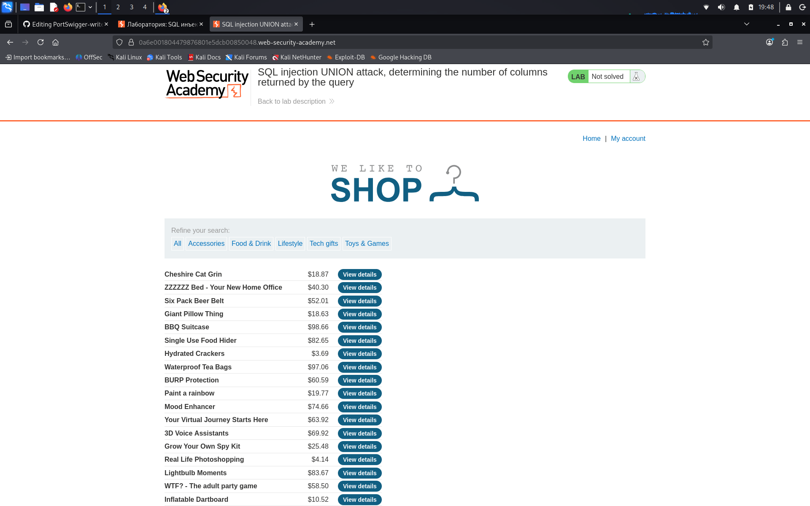

# Lab: SQL injection UNION attack, determining the number of columns returned by the query

**Сложность:** Practitioner  
**Тема:** SQL-Injection  
**Ссылка:** [PortSwigger](https://portswigger.net/web-security/sql-injection/union-attacks/lab-determine-number-of-columns)  

## 1. Описание уязвимости

Эта лаборатория содержит уязвимость инъекций SQL в фильтре категории продукта. Результаты запроса возвращаются в ответе приложения, поэтому вы можете использовать атаку UNION для извлечения данных из других таблиц. Первым шагом такой атаки является определение количества колонн, которые возвращаются запросом.

---

## 2. Разведка

Зашел на страницу, тут у нас магазин, есть выбор разных категорий, показана стоимость продукта, а так же монжо смотреть детали товара.

##
