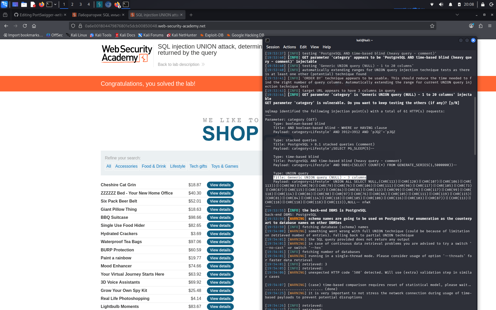

# Lab: SQL injection UNION attack, determining the number of columns returned by the query

**Сложность:** Practitioner  
**Тема:** SQL-Injection  
**Ссылка:** [PortSwigger](https://portswigger.net/web-security/sql-injection/union-attacks/lab-determine-number-of-columns)  

## 1. Описание уязвимости

Эта лаборатория содержит уязвимость инъекций SQL в фильтре категории продукта. Результаты запроса возвращаются в ответе приложения, поэтому вы можете использовать атаку UNION для извлечения данных из других таблиц. Первым шагом такой атаки является определение количества колонн, которые возвращаются запросом.

---

## 2. Разведка

Зашел на страницу, тут у нас магазин, есть выбор разных категорий, показана стоимость продукта, а так же монжо смотреть детали товара.

---

## 3. Ход решения

В этой лабе необходимо узнать количество колонн, у меня это получилось сделать через `sqlmap` с помощью такого запроса: `sqlmap -u "https://0a6e001804479876801e5dcb00850048.web-security-academy.net/filter?category=Lifestyle" --dbs -D --batch`. Но этого не достаточно для решения этой лабораторной, необходимо решить вручную через `BurpSuite` или изменяя запрос в URL браузера.

Вот так получилось через `sqlmap`. Зная точное количество можно простым образом сделать это вручную, к тому же зная что мы имеем дело с `PostgreSQL`: `' ORDER BY 1,2,3--`
