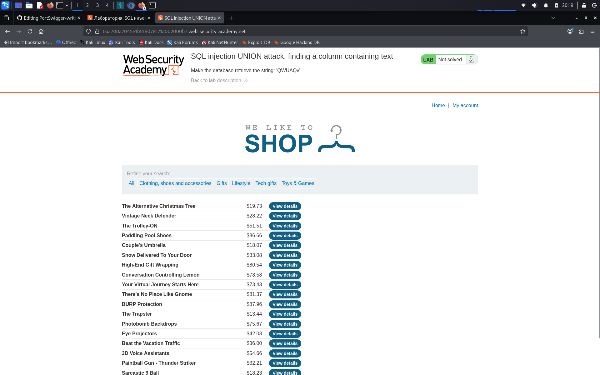

# SQL injection UNION attack, finding a column containing text

**Сложность:** Practitioner  
**Тема:** SQL-Injection  
**Ссылка:** [PortSwigger](https://portswigger.net/web-security/sql-injection/union-attacks/lab-find-column-containing-text)  

## 1. Описание лабораторной

Эта лаборатория содержит уязвимость инъекций SQL в фильтре категории продукта. Результаты запроса возвращаются в ответе приложения, поэтому вы можете использовать атаку UNION для извлечения данных из других таблиц. Чтобы построить такую атаку, сначала нужно определить количество колонн, возвращаемых запросом. Вы можете сделать это, используя технику, которую вы изучили в предыдущей лаборатории. Следующим шагом является идентификация столбца, совместимого со строковыми данными.

---

## 2. Разведка

Встечает нас та страница, которая была в 7-ой лабораторной: магазин, можно войти в аккаунт, посмотреть детали товара.

---

## 3. Ход решения

Сначала определим количество колонн. Изменим URL на такой: ?category=' ORDER BY 1,2,3-- 
