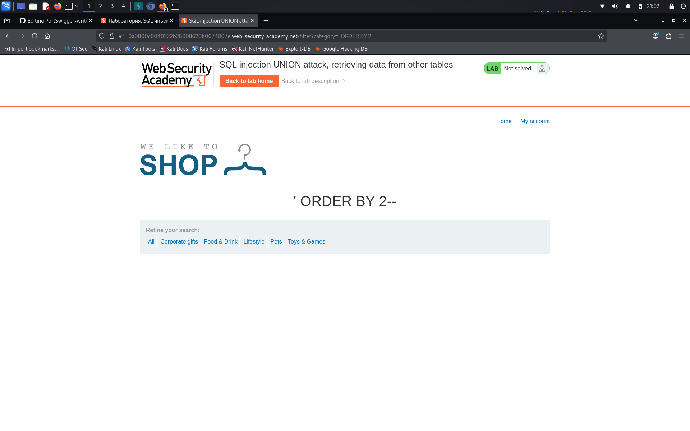
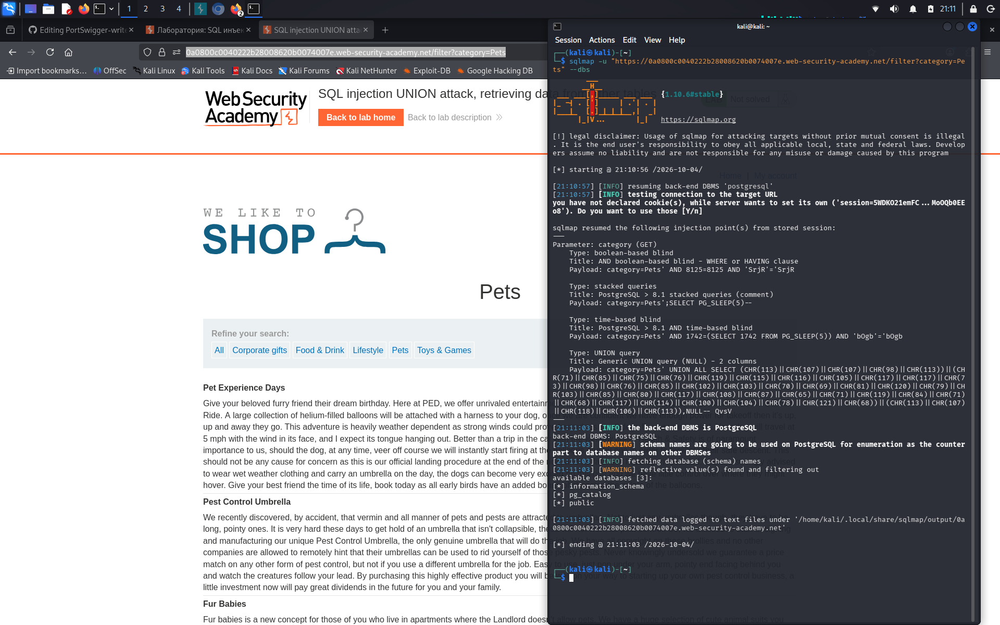
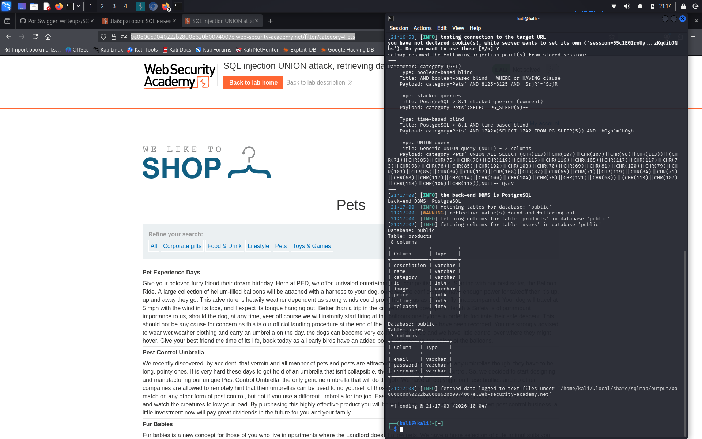

# Lab: SQL injection UNION attack, retrieving data from other tables

**Сложность:** Practitioner  
**Тема:** SQL-Injection  
**Ссылка:** [PortSwigger](https://portswigger.net/web-security/sql-injection/union-attacks/lab-retrieve-data-from-other-tables)

## 1. Описание уязвимости

Эта лаборатория содержит уязвимость инъекций SQL в фильтре категории продукта. Результаты запроса возвращаются в ответе приложения, поэтому вы можете использовать атаку UNION для извлечения данных из других таблиц. Чтобы создать такую атаку, вам нужно объединить некоторые из методов, которые вы изучили в предыдущих лабораториях.

---

## 2. Разведка 

Открыл лабораторную - это интернет-магазин с фильтром категорий. Можно заходить в аккаунт. Ссылку с категорией изменил на такую: `' ORDER BY 2--`, кстати можно еще и так: `' UNION SELECT NULL,NULL--`. Это помогло мне понять что всего у нас 2 колонны.

---

## 3. Ход решения

И так, мы узнали что всего 2 колонн, с помощю способа показанного выше. С помощью такого запроса в sqlmap я узнал названия схем, если так можно назвать: s`qlmap -u "https://0a0800c0040222b28008620b0074007e.web-security-academy.net/filter?category=Pets" --dbs`.

А именно: `information_schema`, `pg_catalog`, `public`. Решил посетить `public`, с помощью такого запроса я узнал колонны в двух дб: s`qlmap -u "https://0a0800c0040222b28008620b0074007e.web-security-academy.net/filter?category=Pets" --batch -D public --columns`.

