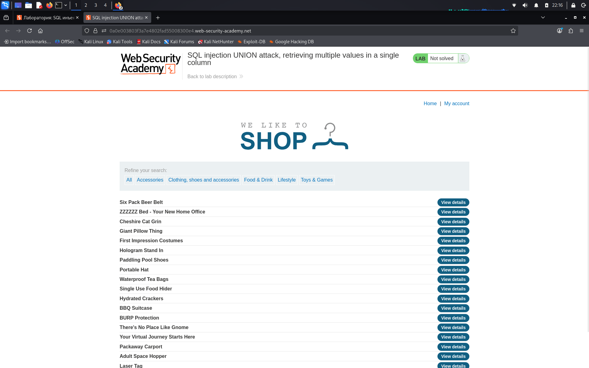
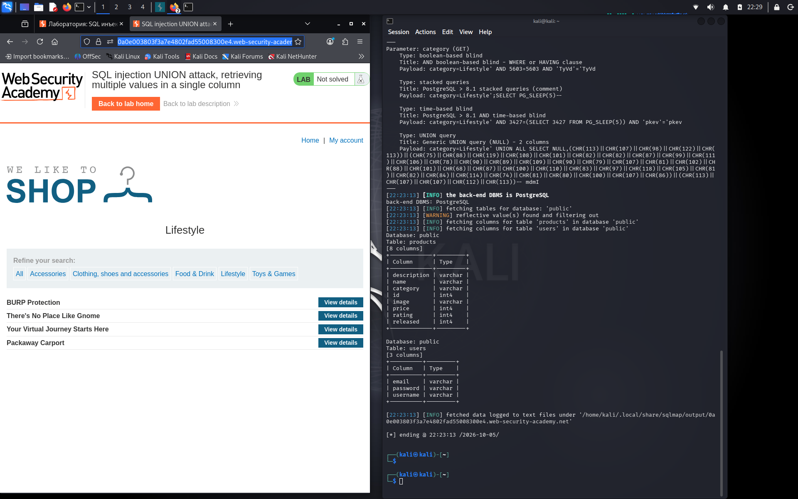

# SQL injection UNION attack, retrieving multiple values in a single column

**Сложность:** Practitioner  
**Тема:** SQL-Injection  
**Ссылка:** [PortSwigger](https://portswigger.net/web-security/sql-injection/union-attacks/lab-retrieve-multiple-values-in-single-column)  

## 1. Описание уязвимости

Эта лаборатория содержит уязвимость инъекций SQL в фильтре категории продукта. Результаты запроса возвращаются в ответе приложения, чтобы вы могли использовать атаку UNION для получения данных из других таблиц.

---

## 2. Разведка

Зашел на сайт, это магазин с разными категориями, можно смотреть детали продукта, можно заходить в аккаунт.

---

## 3. Ход решения

После такого запроса в `sqlmap`: `sqlmap -u "https://0a0e003803f3a7e4802fad55008300e4.web-security-academy.net/filter?category=Lifestyle" --batch -D public --columns` я узнал, что в датабазе `public` есть таблицы `users` и `products`, в таблице `users` есть колонны `password`, `email`, `username`. Поэтому нам осталось залезть в логины и пароли и узнать пароль администратора.

