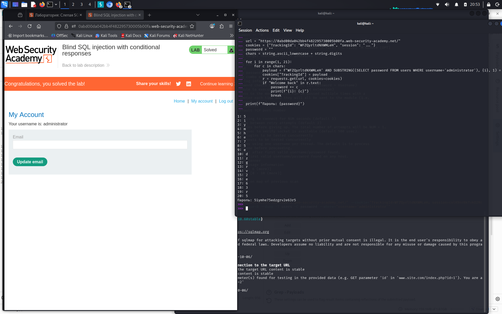

# Blind SQL injection with conditional responses

**Сложность:** Practitioner  
**Тема:** SQL-Injection  
**Ссылка:** [PortSwigger](https://portswigger.net/web-security/sql-injection/blind/lab-conditional-responses)  

## 1. Описание уязвимости

Эта лаборатория содержит слепую уязвимость инъекций SQL. Приложение использует файл cookie отслеживания для аналитики и выполняет запрос SQL, содержащий значение представленного файла cookie. Результаты запроса SQL не возвращаются, и сообщения об ошибках не отображаются. Но приложение включает в себя Welcome backсообщение на странице, если запрос возвращает какие-либо строки.

---

## 2. Разведка

Открыл лабораторную - интернет-магазин с cookie `TrackingId`. Проверил подстановку `' AND 1=1--` - в ответе появилось "Welcome back!", а при `' AND 1=2--` - исчезло. Это подтвердило blind SQL-инъекцию. Определил длину пароля администратора через `LENGTH(password) = 20`. Дальше использовал Python-скрипт для перебора символов.

---

## 3. Ход решения

Использовал Python-скрипт для перебора символов пароля через `SUBSTRING`. Скрипт отправлял запросы с payload в cookie `TrackingId` и проверял наличие "Welcome back!". Собрал пароль `5iymhe75edzgrv2e63r5`. Вошёл под `administrator`.

---
