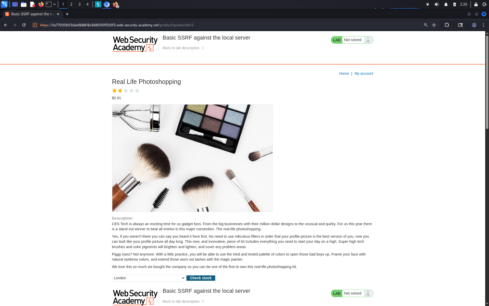
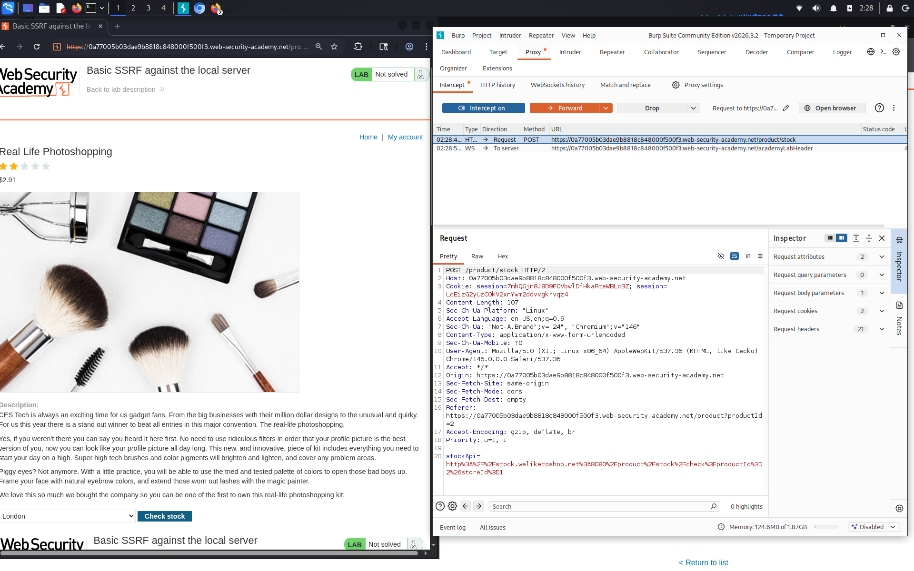
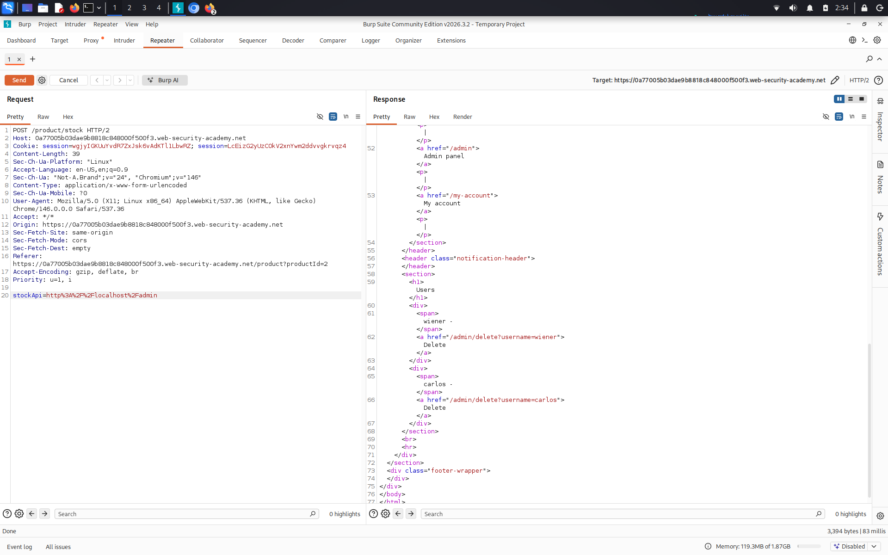

# Basic SSRF against the local server

**Сложность:** Apprentice  
**Тема:** SSRF  
**Ссылка:** [PortSwigger](https://portswigger.net/web-security/ssrf/lab-basic-ssrf-against-localhost)

## 1. Описание уязвимости

В этой лаборатории есть функция проверки запасов, которая извлекает данные из внутренней системы.

---

## 2. Разведка

Зашел на сайт, это интернет магазин, можно выбирать категори. Так же есть кнопка `Check stock`.

---

## 3. Ход решения

Через `BurpSuite` перехватил запрос, когда нажимал на кнопку `Check stock`:

После этого изменил в запросе `stockApi` на такое: `http://localhost`. После отправки запроса сайт не выдал ошибку, значит действительно сайт уязвим к `SSRF`. Дальше я попробовал найти панель админа, изменив запрос на такой: `http://localhost/admin`:

По условию лаборатории необходимо удалить пользователя `carlos`, сделаю это, изменив запрос на такой: `http://localhost/admin/delete?username=carlos`

Получилось провести SSRF атаку, в которой удаляется пользователь `carlos`.
