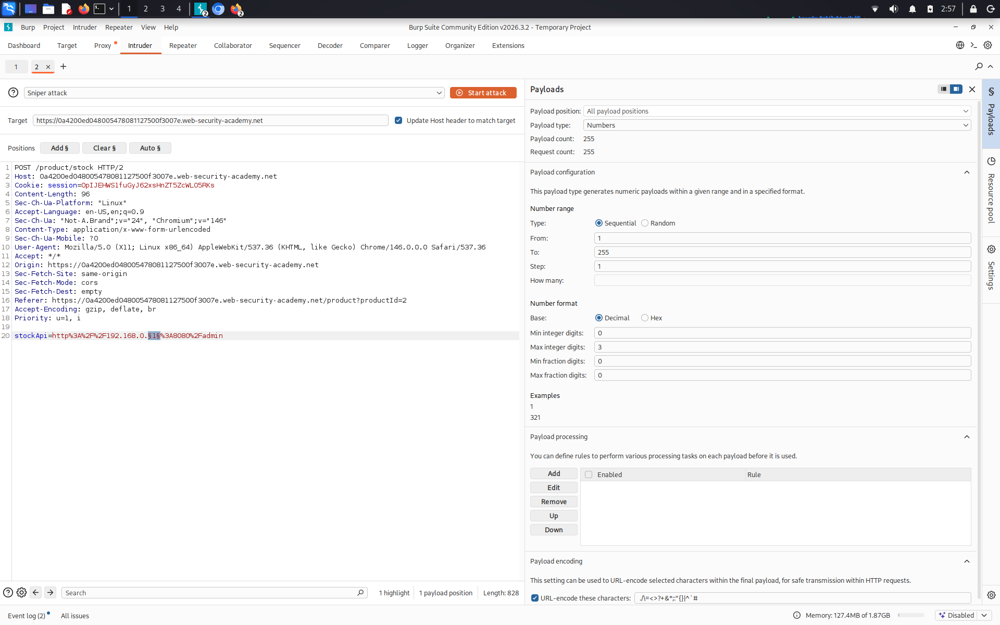
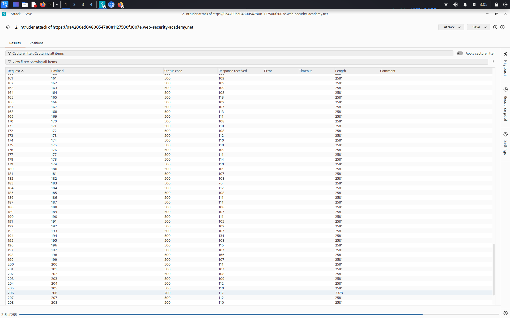

# Basic SSRF against another back-end system

**Сложность:** Apprentice  
**Тема:** SSRF  
**Ссылка:** [PortSwigger](https://portswigger.net/web-security/ssrf/lab-basic-ssrf-against-backend-system)  

## 1. Описание уязвимости

В этой лаборатории есть функция проверки запасов, которая извлекает данные из внутренней системы.

---

## 2. Разведка

Открыл лабораторную - интернет-магазин. Перехватил запрос на проверку товара через Burp — параметр `stockApi` принимает URL. В первой лабе я обращался к `localhost`, но здесь цель другая - внутренняя система. Из описания лабы известно, что в внутренней сети есть бэкенд-сервер на `192.168.0.X`. Нужно просканировать диапазон, найти админ-панель и удалить пользователя `carlos`.

## 3. Ход решения

Я перехватил запрос через `BurpSuite` и перенаправил его в `intruder`, настроил `payload` и изменил `stockApi` на такой: `http%3A%2F%2F192.168.0.1%3A8080%2Fadmin`. Я начал перебирать от 1 до 255 для того, чтобы найти админ панель и в последующем удалить пользователя `carlos`:

Я нашел что хост 206 - админ панель, так как он единственный помимо хоста 1 выдавал статус 200 а также по сравнению с другими у него другая длина:

После того, как я нашел хост админ панели, я изменил `stockApi` на такой: `http%3A%2F%2F192.168.0.206%3A8080%2Fadmin%2Fdelete?username=carlos`. Пользователя удалить удалось - лаба решена.
