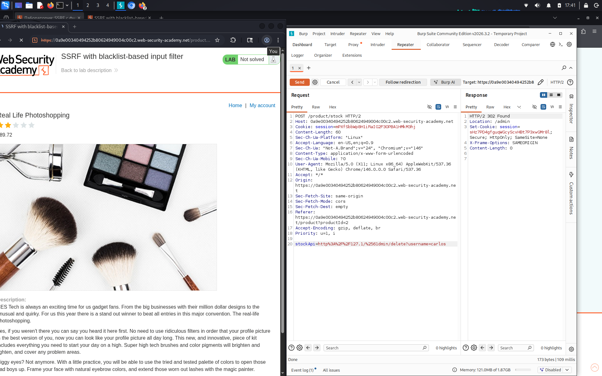

# SSRF with blacklist-based input filter

**Сложность:** Practitioner  
**Тема:** SSRF  
**Ссылка:** [PortSwigger](https://portswigger.net/web-security/ssrf/lab-ssrf-with-blacklist-filter)  

## 1. Описание уязвимости

В этой лаборатории есть функция проверки запасов, которая извлекает данные из внутренней системы.

---

## 2. Разведка

Это интерент-магазин, я перехватил запрос с параметром `stockApi`, и изменял его на такие: `http://128.0.0.1/` и `http://localhost`. Понял что они в черном списке, поэтому надо обходить черный список.

---

## 3. Ход решения

Я уже знаю что `127.0.0.1` и `localhost` в черном списке, поэтому попробовал сокращенный вид: `127.1`, сайт откликается. Дальше я проверил можно ли сразу попасть в админскую панель: `127.1/admin` - нет, блокируется, теперь попробую закодировать букву `a` таким образом: `%2561`. В итоге у меня получился такой `stockApi`: `http://127.1/%2561dmin`, который дает доступ к админской панели, осталось только удалить пользователя `carlos`: `http://127.1/%2561dmin/delete?username=carlos`. Всё получилось - лаба решена.

---
