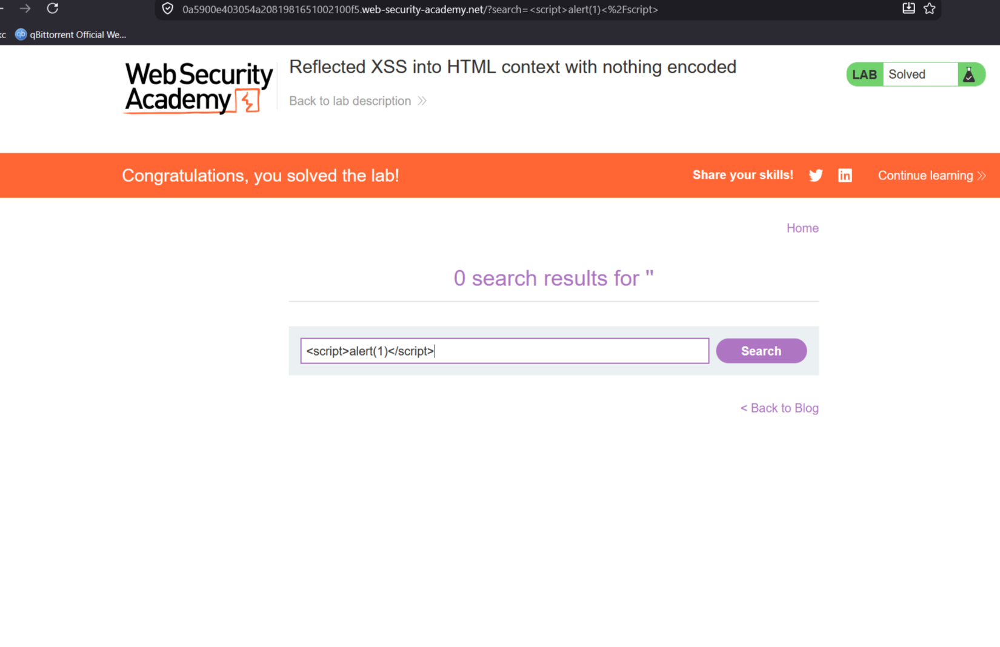

# Reflected XSS into HTML context with nothing encoded

**Сложность:** Apprentice
**Тема:** XSS
**Ссылка** [PortSwigger](https://portswigger.net/web-security/cross-site-scripting/reflected/lab-html-context-nothing-encoded)

## 1. Описание уязвимости

Параметр `search` в URL отражается на странице без какой-либо обработки (экранирования).  
Это позволяет внедрить произвольный JavaScript-код, который выполнится в браузере жертвы.

---

## 2. Разведка

Открыл лабораторию, увидел страницу, где люди делятся блогами, обратил внимание на поиск `search`.

---

## 3. Ход решения

Увидел параметр `search`, вбил туда этот скрипт: ``, хоть это и простейшее задание XSS, но я все равно решил поделиться им.

