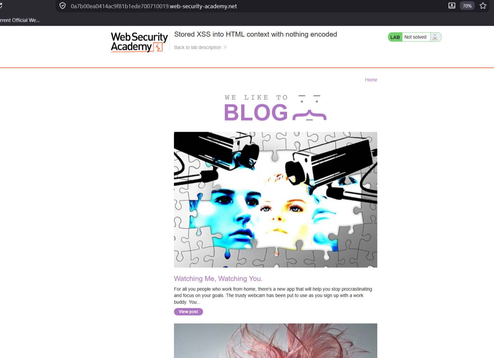
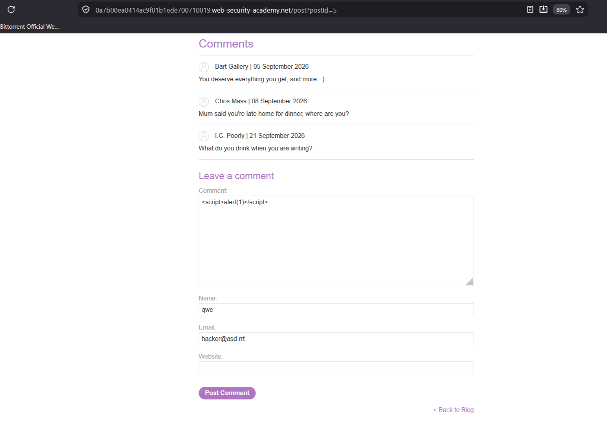

# Stored XSS into HTML context with nothing encoded

**Сложность:** Apprentice
**Тема:** XSS
**Ссылка** [PortSwigger](https://portswigger.net/web-security/cross-site-scripting/stored/lab-html-context-nothing-encoded)

## 1. Описание уязвимости

Комментарии к постам сохраняются в базе данных и отображаются на странице **без экранирования**.  
Это позволяет внедрить произвольный JavaScript-код, который выполнится у **каждого**, кто откроет страницу с комментарием.

---

## 2. Разведка

Открыл лабораторную, увидел тот же сайт с блогами людей, но только без search, на этот раз под блогами можно оставлять коментарии, что позволит нам внедрить произвольный код.

---

## 3. Ход  решения

Зашел в один из блогов, увидел что можно оставлять комментарии, написал такой код , отправил комментарий, xss-атака была успешно проведена.

