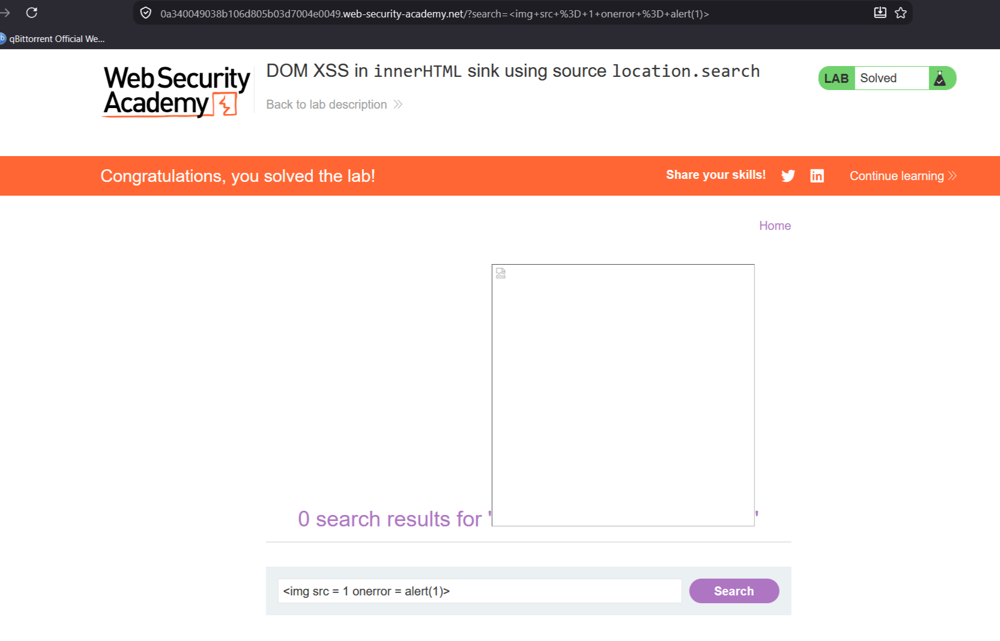

# DOM XSS in innerHTML sink using source location.search

**Сложность:** Apprentice  
**Тема:** XSS  
**Ссылка:** [PortSwigger](https://portswigger.net/web-security/cross-site-scripting/dom-based/lab-innerhtml-sink)  

## 1. Описание уязвимости

Приложение получает данные из параметра `search` в URL (`location.search`) и передаёт их в **`innerHTML`** без обработки.  
Это позволяет внедрить произвольный HTML и JavaScript, который выполнится в браузере жертвы.

---

## 2. Разведка

Открыл лабораторную - это блог с функцией поиска. Ввёл в поиск `test` - в URL появился параметр `?search=test`. Проверил исходный код страницы через Ctrl+U - уязвимый JavaScript скрыт PortSwigger. Из описания лабы известно, что данные берутся из `location.search`. Вывод: параметр `search` передаётся в `innerHTML` без экранирования.

---

## 3. Ход решения

Ввел в поиск . Нажал "Search" браузер попытался загрузить картинку `x` → ошибка → сработал `onerror` → выполнился `alert(1)`. Уязвимсть успешно применена.

