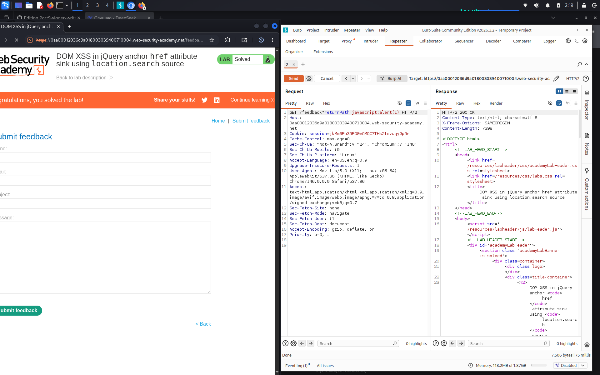

# DOM XSS in jQuery anchor href attribute sink using location.search source

**Сложность:** Apprentice  
**Тема:** XSS  
**Ссылка:** [PortSwigger](https://portswigger.net/web-security/cross-site-scripting/dom-based/lab-jquery-href-attribute-sink)  

## 1. Описание уязвимости

Эта лаборатория содержит уязвимость кросс-сайтов на основе DOM на странице обратной связи. Он использует библиотеку `jQuery` $функция селектора для поиска якорного элемента и изменения его `href` атрибуты, использующие данные из `location.search`.

---

## 2. Разведка

Открыл лабораторную, это блог с функцией обратной связи. В URL заметил параметр `?returnPath=/`. Проверил исходный код страницы: jQuery берёт значение из `location.search` и подставляет его в атрибут `href` ссылки "Back". Это потенциальный sink. Значит, можно внедрить JavaScript через `javascript:` в `returnPath`.

---

## 3. Ход решения

Перехватил запрос на странице `/feedback` - в URL есть параметр `returnPath`. В исходном коде нашёл jQuery: `$('#backLink').attr('href', (new URLSearchParams(window.location.search)).get('returnPath'));`. Это DOM-based XSS: значение из URL подставляется в `href` без проверки. Заменил `returnPath` на `javascript:alert(1)` - сработал `alert(1)`. Лаба решена.

---
